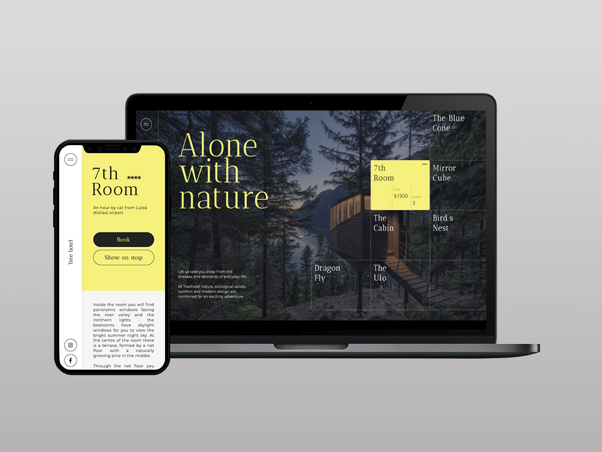

# **`Tree Hotel`**

## **`🌍 Contexte :`**

Exercice d'intégration et d'animation CSS/ JS.

## **`🚀 Objectif :`**

Intégrer une application web statique à but démonstratif. 

- Intégrer et styliser à l'aide du pré-processeur Sass.
- Utiliser des variables, mixins, listes et maps.
- Intégrer des fonctions Javascript simples pour animer l'affichage.

#

   

## **`🔒 Contraintes techniques :`**
- HTML/ CSS.
- SASS.
- Vanilla JS.
- Responsive Web Design.
- W3C/ RGGA/ SEO.  
 
 #

Let's connect 🔗

